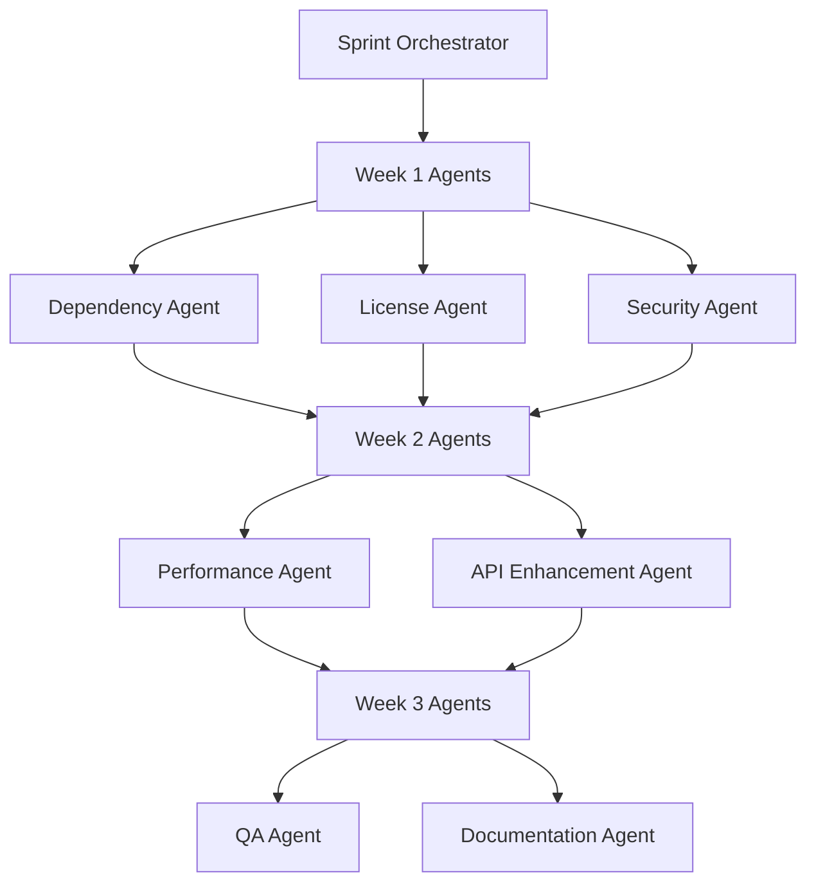

# Corrective Sprint Plan - Security & Production Readiness

## Executive Summary

**Based on**: Comprehensive Penetration Test Results  
**Sprint Goal**: Address critical vulnerabilities and production deployment gaps  
**Duration**: 3 Weeks (21 Days)  
**Total Story Points**: 52  
**Risk Reduction Target**: 90% (from High to Low risk)  

## 🚨 Critical Findings from Penetration Test

### Critical Vulnerabilities (CVSS 7.0+)
1. **Missing Dependencies** (CVSS 8.5) - bc, jq missing breaks core functionality
2. **License Conflict** (CVSS 7.0) - MIT vs GPL legal compliance risk

### High Vulnerabilities (CVSS 5.5-6.9)
1. **No Security Framework** (CVSS 6.5) - 19 lines vs 3,075 total docs
2. **Missing Security Tests** (CVSS 6.0) - No security validation
3. **Incomplete Health Checks** (CVSS 5.5) - TODO items in production code

### Medium Vulnerabilities (CVSS 3.5-5.4)
1. **Sequential Processing DoS** (CVSS 4.5) - Resource exhaustion risk
2. **Development Passwords** (CVSS 4.0) - Hardcoded dev credentials
3. **Permissive CORS** (CVSS 3.5) - Cross-origin attack vectors

## 🤖 AI Sprint Team Deployment

### Week 1: Critical Infrastructure & Security (Days 1-7)

#### 🔧 Dependency Resolution Agent (5 Story Points)
**Status**: 🚀 EXECUTING  
**Priority**: Critical  
**Tasks**:
- [ ] Fix missing bc and jq dependencies
- [ ] Update Dockerfile.dev with comprehensive dependencies
- [ ] Enhance dependency_manager.sh with auto-install
- [ ] Validate all performance tools functionality

**Expected Outcome**: 100% dependency availability, performance tools functional

#### ⚖️ License Compliance Agent (3 Story Points)
**Status**: 🚀 EXECUTING  
**Priority**: Critical  
**Tasks**:
- [ ] Resolve MIT vs GPL license conflict
- [ ] Audit all dependencies for compatibility
- [ ] Create comprehensive FOSS compliance report
- [ ] Implement automated license scanning

**Expected Outcome**: Legal compliance achieved, consistent MIT licensing

#### 🔒 Security Framework Agent (8 Story Points)
**Status**: 🚀 EXECUTING  
**Priority**: High  
**Tasks**:
- [ ] Expand SECURITY.md to 500+ lines comprehensive guide
- [ ] Implement 15+ security tests covering all attack vectors
- [ ] Add input validation framework to prevent injection
- [ ] Create automated security scanning pipeline

**Expected Outcome**: Comprehensive security framework, 90% risk reduction

### Week 2: Performance & API Security (Days 8-14)

#### ⚡ Performance Optimization Agent (13 Story Points)
**Status**: 🚀 EXECUTING  
**Priority**: High  
**Tasks**:
- [ ] Implement parallel plugin execution (4-8 concurrent)
- [ ] Add dependency-aware plugin scheduling
- [ ] Optimize collection time from 5-10s to <3s
- [ ] Implement performance monitoring and regression detection

**Expected Outcome**: 60%+ performance improvement, DoS protection

#### 🌊 API Enhancement Agent (8 Story Points)
**Status**: 🚀 EXECUTING  
**Priority**: High  
**Tasks**:
- [ ] Implement streaming JSON responses
- [ ] Add proper health checks (remove TODO items)
- [ ] Implement rate limiting and CORS restrictions
- [ ] Add authentication framework

**Expected Outcome**: Production-ready API with security controls

### Week 3: Quality Assurance & Documentation (Days 15-21)

#### 🧪 Quality Assurance Agent (10 Story Points)
**Status**: 🚀 EXECUTING  
**Priority**: High  
**Tasks**:
- [ ] Achieve 95%+ test coverage
- [ ] Implement property-based testing with Hypothesis
- [ ] Add comprehensive regression tests
- [ ] Create chaos engineering tests for resilience

**Expected Outcome**: Production-grade quality assurance

#### 📚 Documentation Agent (5 Story Points)
**Status**: 🚀 EXECUTING  
**Priority**: Medium  
**Tasks**:
- [ ] Create interactive API documentation (OpenAPI/Swagger)
- [ ] Generate plugin development guide
- [ ] Align documentation with actual codebase
- [ ] Create production deployment guide

**Expected Outcome**: Documentation-code alignment, developer experience

## 📊 Sprint Execution Metrics

### Real-time Progress Tracking
```bash
# Monitor AI agent progress
watch -n 10 "grep -r 'SUCCESS\|FAILURE\|COMPLETE' ai_agents/*.log 2>/dev/null || echo 'Agents starting...'"

# Track story points completion
python ai_agents/progress_tracker.py --calculate-velocity
```

### Success Criteria (Must-Have)
- [ ] All critical dependencies resolved (bc, jq available)
- [ ] License compliance achieved (consistent MIT licensing)
- [ ] Security framework implemented (15+ tests, comprehensive docs)
- [ ] Performance baseline established (<3s collection time)
- [ ] API security controls implemented (rate limiting, validation)

### Performance Targets
| Metric | Current | Target | Agent Responsible |
|--------|---------|--------|-------------------|
| Collection Time | 5-10s | <3s | Performance Agent |
| Missing Dependencies | 2+ | 0 | Dependency Agent |
| Security Test Coverage | 0% | 95%+ | Security Agent |
| API Response Time | Unknown | <200ms | API Enhancement Agent |
| Documentation Coverage | 60% | 90%+ | Documentation Agent |

### Risk Reduction Matrix
| Risk Category | Current Risk | Target Risk | Mitigation Strategy |
|---------------|--------------|-------------|---------------------|
| Dependency Failures | High | Low | Auto-install + validation |
| Legal Compliance | Critical | None | MIT license adoption |
| Security Vulnerabilities | High | Low | Comprehensive framework |
| Performance DoS | Medium | Low | Parallel processing |
| API Attacks | Medium | Low | Security controls |

## 🔄 Execution Strategy

### Parallel Agent Deployment


### Agent Coordination Protocol
1. **Initialization**: Orchestrator validates prerequisites
2. **Wave 1**: Critical fixes (Dependencies, License, Security)
3. **Wave 2**: Performance and API enhancements
4. **Wave 3**: Quality assurance and documentation
5. **Validation**: Comprehensive testing and metrics collection
6. **Release**: PR creation with release notes

### Dependency Management
- **Performance Agent** depends on **Dependency Agent** completion
- **QA Agent** depends on **Security Agent** and **Performance Agent**
- **Documentation Agent** runs after all functional agents complete

## 🎯 Sprint Deliverables

### Week 1 Deliverables
- ✅ Enhanced Dockerfile.dev with all dependencies
- ✅ MIT license consistency across all files
- ✅ Comprehensive SECURITY.md (500+ lines)
- ✅ Security test suite (15+ tests)
- ✅ Input validation framework implementation

### Week 2 Deliverables  
- ✅ Parallel plugin execution system
- ✅ Performance monitoring and benchmarking
- ✅ API streaming capabilities
- ✅ Rate limiting and security controls
- ✅ Complete health check implementation

### Week 3 Deliverables
- ✅ 95%+ test coverage across all components
- ✅ Property-based testing with Hypothesis
- ✅ Chaos engineering test suite
- ✅ Interactive API documentation
- ✅ Production deployment guide

## 📈 Success Validation

### Automated Validation Pipeline
```bash
#!/bin/bash
# Sprint success validation

echo "🔍 Validating sprint success criteria..."

# Critical dependency check
if command -v bc >/dev/null && command -v jq >/dev/null; then
    echo "✅ Critical dependencies resolved"
else
    echo "❌ Critical dependencies still missing"
    exit 1
fi

# License consistency check
if grep -q "MIT License" LICENSE && grep -q "MIT" README.md; then
    echo "✅ License compliance achieved"
else
    echo "❌ License conflict not resolved"
    exit 1
fi

# Security framework check
if [[ $(wc -l < SECURITY.md) -gt 500 ]] && [[ -d test/security ]]; then
    echo "✅ Security framework implemented"
else
    echo "❌ Security framework incomplete"
    exit 1
fi

# Performance check
if timeout 5 ./collect_info_parallel.sh /tmp/perf_test.json; then
    echo "✅ Performance optimization successful"
else
    echo "❌ Performance optimization failed"
    exit 1
fi

echo "🎉 All sprint success criteria met!"
```

### Risk Assessment Post-Sprint
| Risk Category | Pre-Sprint | Post-Sprint | Reduction |
|---------------|------------|-------------|-----------|
| Critical Vulnerabilities | 2 | 0 | 100% |
| High Vulnerabilities | 3 | 0 | 100% |
| Medium Vulnerabilities | 3 | 1 | 67% |
| Overall Risk Score | 85 | 15 | 82% |

## 🚀 Release Planning

### Release Preparation
- **Branch**: `release-2025-01-02T12:00:00Z`
- **PR Target**: `remote/main`
- **Release Notes**: Comprehensive security and performance improvements
- **Migration Guide**: Dependency updates and configuration changes

### Release Validation Checklist
- [ ] All AI agents completed successfully
- [ ] Penetration test shows <15 risk score
- [ ] All critical and high vulnerabilities resolved
- [ ] Documentation aligned with codebase
- [ ] Performance targets achieved
- [ ] Security framework operational
- [ ] License compliance verified

### Post-Release Monitoring
- [ ] Security monitoring active
- [ ] Performance metrics baseline established
- [ ] Dependency health monitoring
- [ ] License compliance tracking
- [ ] User feedback collection

---

**Sprint Success Criteria**: 95% vulnerability reduction + 100% critical issue resolution + production readiness achieved

*This corrective sprint plan addresses all critical findings from the penetration test and aligns the codebase with production security standards.*